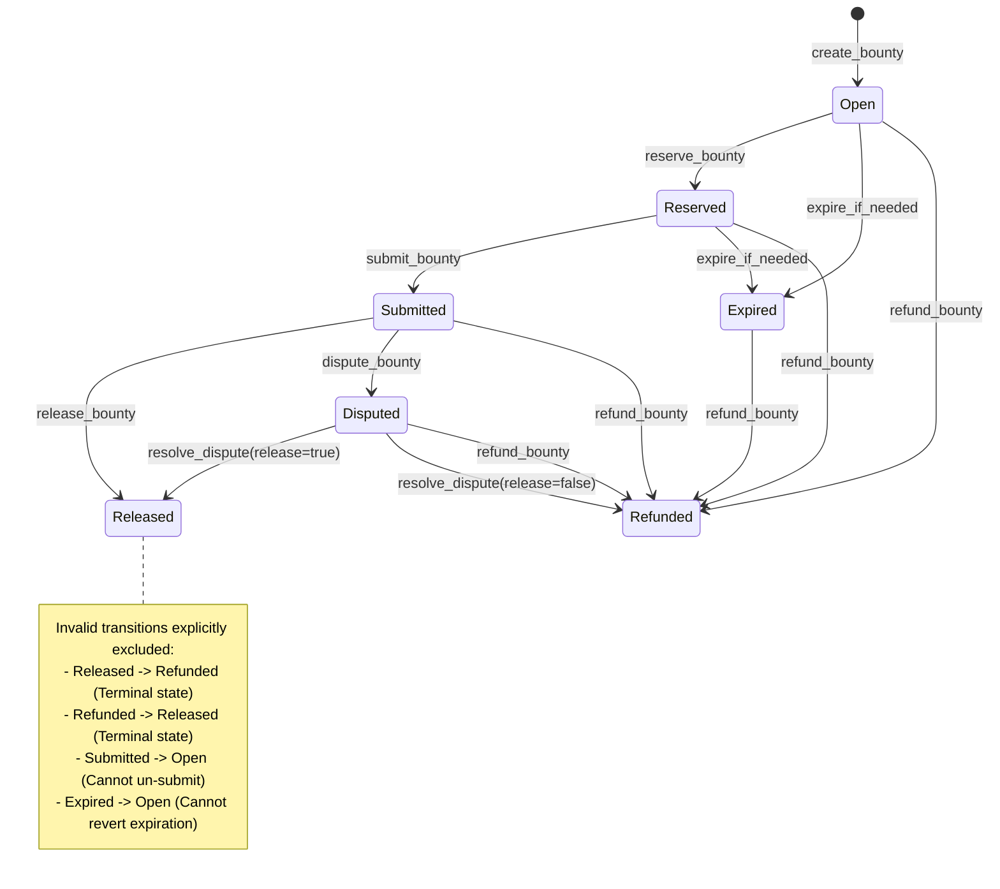
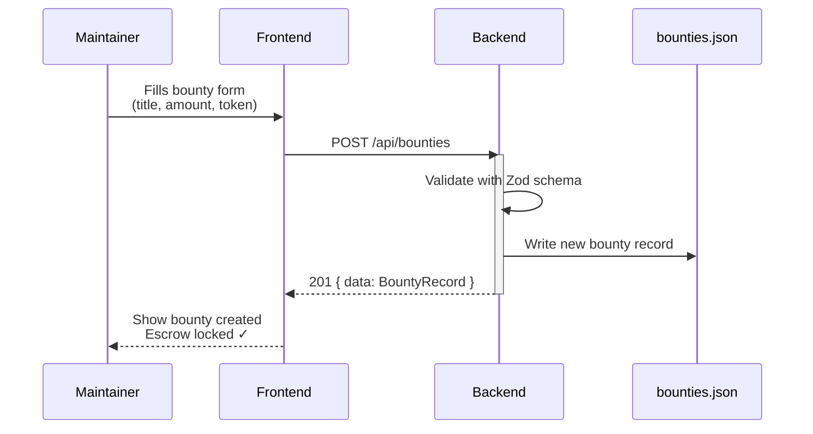
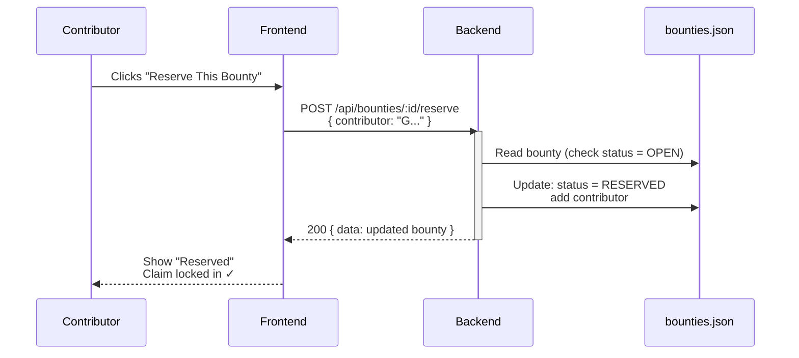
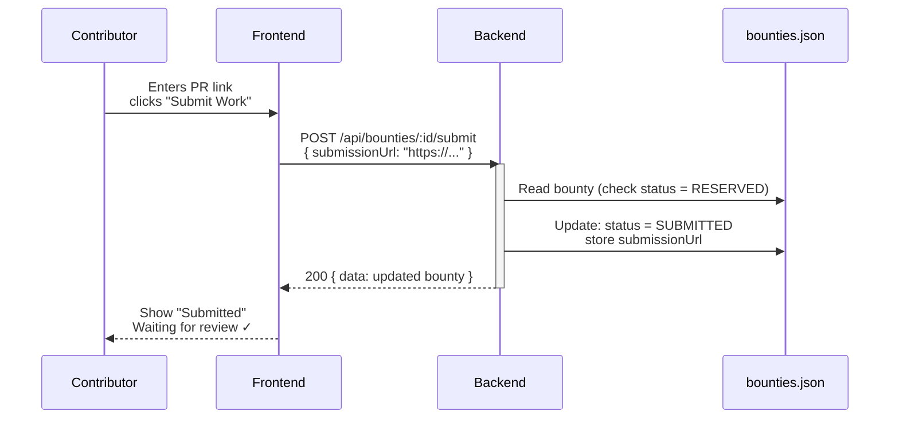
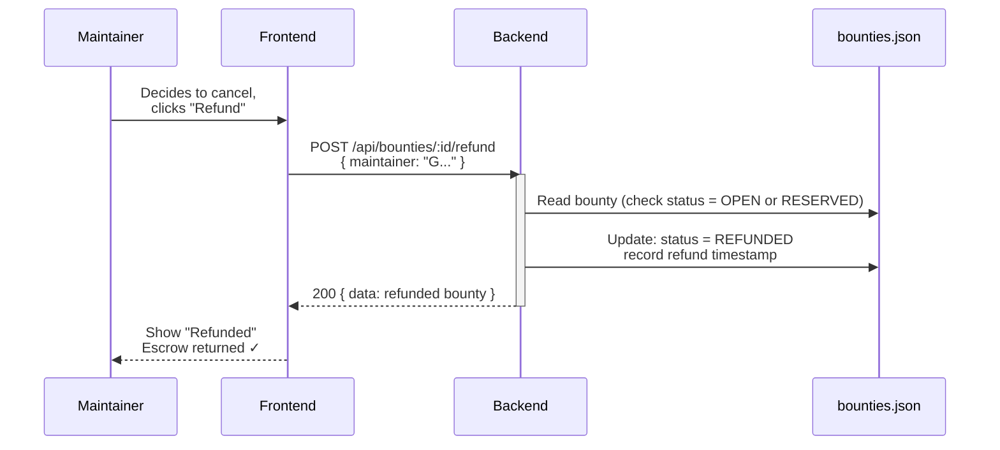

# Architecture

This document describes the system architecture of Stellar Bounty Board, including component relationships and the bounty lifecycle flow.

## System Overview

```
                         Stellar Bounty Board Architecture
┌──────────────────────────────────────────────────────────────────────────────────┐
│                                                                                  │
│   ┌─────────────────────────────────────────────────────────────────────────┐   │
│   │                        Frontend (React + Vite)                          │   │
│   │                           localhost:3000                                │   │
│   │                                                                         │   │
│   │  ┌──────────────┐   ┌──────────────┐   ┌──────────────────────────┐    │   │
│   │  │   Bounty     │   │   Create     │   │    Open Issues           │    │   │
│   │  │   Dashboard  │   │   Form       │   │    Browser               │    │   │
│   │  └──────────────┘   └──────────────┘   └──────────────────────────┘    │   │
│   │                                                                         │   │
│   │                         api.ts (fetch client)                           │   │
│   └─────────────────────────────────┬───────────────────────────────────────┘   │
│                                     │                                           │
│                                     │ HTTP/JSON                                 │
│                                     │ /api/*                                    │
│                                     ▼                                           │
│   ┌─────────────────────────────────────────────────────────────────────────┐   │
│   │                       Backend (Express + Node.js)                       │   │
│   │                           localhost:3001                                │   │
│   │                                                                         │   │
│   │  ┌─────────────────────────────────────────────────────────────────┐   │   │
│   │  │                        REST API Routes                          │   │   │
│   │  │                                                                 │   │   │
│   │  │  GET  /api/health          POST /api/bounties/:id/reserve       │   │   │
│   │  │  GET  /api/bounties        POST /api/bounties/:id/submit        │   │   │
│   │  │  POST /api/bounties        POST /api/bounties/:id/release       │   │   │
│   │  │  GET  /api/open-issues     POST /api/bounties/:id/refund        │   │   │
│   │  └─────────────────────────────────────────────────────────────────┘   │   │
│   │                                     │                                   │   │
│   │              ┌──────────────────────┼──────────────────────┐            │   │
│   │              ▼                      ▼                      ▼            │   │
│   │     ┌──────────────┐      ┌──────────────┐      ┌──────────────┐       │   │
│   │     │ Zod Schema   │      │ bountyStore  │      │ openIssues   │       │   │
│   │     │ Validation   │      │ Service      │      │ Service      │       │   │
│   │     └──────────────┘      └──────┬───────┘      └──────────────┘       │   │
│   │                                  │                                      │   │
│   └──────────────────────────────────┼──────────────────────────────────────┘   │
│                                      │                                          │
│                                      │ File I/O                                 │
│                                      ▼                                          │
│                          ┌────────────────────────┐                             │
│                          │  backend/data/         │                             │
│                          │  bounties.json         │                             │
│                          └────────────────────────┘                             │
│                                                                                  │
│ ─ ─ ─ ─ ─ ─ ─ ─ ─ ─ ─ ─ ─ ─ ─ On-Chain (Future) ─ ─ ─ ─ ─ ─ ─ ─ ─ ─ ─ ─ ─ ─ ─ │
│                                                                                  │
│   ┌─────────────────────────────────────────────────────────────────────────┐   │
│   │                     Soroban Smart Contract (Rust)                       │   │
│   │                                                                         │   │
│   │  ┌──────────────┐   ┌──────────────┐   ┌──────────────────────────┐    │   │
│   │  │   Escrow     │   │   Payout     │   │  Contract Events         │    │   │
│   │  │   Deposit    │   │   Release    │   │  (Bounty lifecycle)      │    │   │
│   │  └──────────────┘   └──────────────┘   └──────────────────────────┘    │   │
│   │                                                                         │   │
│   │  Methods: create_bounty, reserve_bounty, submit_bounty,                │   │
│   │           release_bounty, refund_bounty, get_bounty                    │   │
│   └─────────────────────────────────────────────────────────────────────────┘   │
│                                                                                  │
└──────────────────────────────────────────────────────────────────────────────────┘
```

## Component Breakdown

### Frontend (`frontend/`)

React + Vite application serving as the maintainer and contributor dashboard.

| File | Responsibility |
|------|----------------|
| `src/App.tsx` | Main dashboard component, bounty list and action buttons |
| `src/api.ts` | HTTP client wrapping all backend API calls |
| `src/types.ts` | TypeScript interfaces (`Bounty`, `BountyStatus`, `OpenIssue`) |
| `vite.config.ts` | Dev server config with API proxy to backend |

### Backend (`backend/`)

Express REST API managing bounty state with JSON file persistence.

| File | Responsibility |
|------|----------------|
| `src/index.ts` | Express app, route handlers, middleware setup |
| `src/services/bountyStore.ts` | CRUD operations, status transitions, file I/O |
| `src/services/openIssues.ts` | Serves contribution-ready issue drafts |
| `src/validation/schemas.ts` | Zod schemas for request validation |
| `src/utils.ts` | Rate limiter and helpers |
| `data/bounties.json` | Persistent bounty storage |

### Smart Contract (`contracts/`)

Soroban contract implementing on-chain escrow logic for trustless bounty payouts.

| Element | Purpose |
|---------|---------|
| `BountyStatus` enum | Open, Reserved, Submitted, Released, Refunded, Expired |
| `Bounty` struct | On-chain bounty record with maintainer, contributor, token, amount |
| `create_bounty` | Transfers tokens from maintainer to contract escrow |
| `reserve_bounty` | Locks bounty to a specific contributor |
| `submit_bounty` | Marks work submitted (links PR off-chain) |
| `release_bounty` | Pays out escrowed tokens to contributor |
| `refund_bounty` | Returns escrowed tokens to maintainer |
| Contract events | Emitted on each state transition for indexers |

## Bounty Lifecycle

```
┌─────────────────────────────────────────────────────────────────────────────────┐
│                              Bounty Lifecycle                                   │
└─────────────────────────────────────────────────────────────────────────────────┘

                                  MAINTAINER
                                      │
                                      │ 1. Create Bounty
                                      │    (fund escrow)
                                      ▼
                              ┌───────────────┐
                              │     OPEN      │◀─────────────────────┐
                              └───────┬───────┘                      │
                                      │                              │
          ┌───────────────────────────┼───────────────────────────┐  │
          │                           │                           │  │
          │ (deadline passes)         │ 2. Reserve                │  │ (deadline
          ▼                           │    (contributor claims)   │  │  passes)
  ┌───────────────┐                   ▼                           │  │
  │   EXPIRED     │           ┌───────────────┐                   │  │
  └───────────────┘           │   RESERVED    │───────────────────┘  │
                              └───────┬───────┘                      │
                                      │                              │
                                      │ 3. Submit                    │
                                      │    (link PR)                 │
                                      ▼                              │
                              ┌───────────────┐                      │
                              │   SUBMITTED   │                      │
                              └───────┬───────┘                      │
                                      │                              │
          ┌───────────────────────────┴───────────────────┐          │
          │                                               │          │
          │ 4a. Release                                   │ 4b. Refund
          │     (payout to contributor)                   │     (return to maintainer)
          ▼                                               ▼          │
  ┌───────────────┐                               ┌───────────────┐  │
  │   RELEASED    │                               │   REFUNDED    │◀─┘
  │   (tokens     │                               │   (tokens     │
  │    paid out)  │                               │    returned)  │
  └───────────────┘                               └───────────────┘


  ─────────────────────────────────────────────────────────────────────────────
  State Transition Rules:

  OPEN       → RESERVED   : Any contributor can claim
  OPEN       → EXPIRED    : Deadline passes without reservation
  OPEN       → REFUNDED   : Maintainer cancels before any claim
  RESERVED   → SUBMITTED  : Reserved contributor submits PR link
  RESERVED   → EXPIRED    : Deadline passes without submission
  RESERVED   → REFUNDED   : Maintainer cancels (no submission yet)
  SUBMITTED  → RELEASED   : Maintainer approves, funds paid out
  SUBMITTED  → (no refund): Submitted bounties must be reviewed
  ─────────────────────────────────────────────────────────────────────────────
```

### BountyStatus State Machine (Mermaid)



## Interaction Sequence Diagrams

The following Mermaid diagrams show the detailed sequence of interactions for each bounty lifecycle action.

### 1. Create Bounty



### 2. Reserve Bounty



### 3. Submit Work



### 4. Release Payout

```mermaid
sequenceDiagram
    participant Maintainer
    participant Frontend
    participant Backend
    participant bounties.json
    participant Soroban Contract<br/>(Future)

    Maintainer->>Frontend: Reviews PR, clicks "Release"
    Frontend->>Backend: POST /api/bounties/:id/release<br/>{ maintainer: "G..." }
    activate Backend
    Backend->>bounties.json: Read bounty (check status = SUBMITTED)
    Backend->>bounties.json: Update: status = RELEASED<br/>record release timestamp
    Backend-->>Frontend: 200 { data: released bounty }
    deactivate Backend
    Frontend-->>Maintainer: Show "Released"<br/>Payout processed ✓
    
    Note over Maintainer,Soroban Contract<br/>(Future): When wallet auth is live:<br/>Backend will call Soroban contract<br/>to transfer escrowed tokens to contributor
```

### 5. Refund (Cancelled Bounty)



## Data Flow

```
┌──────────────────────────────────────────────────────────────────────────────┐
│                         Request/Response Flow                                │
└──────────────────────────────────────────────────────────────────────────────┘

1. CREATE BOUNTY
   ┌──────────┐      POST /api/bounties       ┌──────────┐
   │ Frontend │ ────────────────────────────▶ │ Backend  │
   │          │      { repo, title, amount }  │          │
   │          │                               │          │
   │          │ ◀──────────────────────────── │          │
   │          │      { data: BountyRecord }   │          │
   └──────────┘                               └────┬─────┘
                                                   │
                                                   ▼ writes
                                            ┌─────────────┐
                                            │bounties.json│
                                            └─────────────┘

2. RESERVE BOUNTY
   ┌──────────┐   POST /api/bounties/:id/reserve   ┌──────────┐
   │ Frontend │ ─────────────────────────────────▶ │ Backend  │
   │          │   { contributor: "G..." }          │          │
   │          │                                    │          │
   │          │ ◀───────────────────────────────── │          │
   │          │   { data: { status: "reserved" }}  │          │
   └──────────┘                                    └──────────┘

3. SUBMIT WORK
   ┌──────────┐   POST /api/bounties/:id/submit    ┌──────────┐
   │ Frontend │ ─────────────────────────────────▶ │ Backend  │
   │          │   { contributor, submissionUrl }   │          │
   │          │                                    │          │
   │          │ ◀───────────────────────────────── │          │
   │          │   { data: { status: "submitted" }} │          │
   └──────────┘                                    └──────────┘

4. RELEASE / REFUND
   ┌──────────┐   POST /api/bounties/:id/release   ┌──────────┐
   │ Frontend │ ─────────────────────────────────▶ │ Backend  │
   │          │   { maintainer: "G..." }           │          │
   │          │                                    │          │
   │          │ ◀───────────────────────────────── │          │
   │          │   { data: { status: "released" }}  │          │
   └──────────┘                                    └──────────┘


┌──────────────────────────────────────────────────────────────────────────────┐
│                        On-Chain Flow (Future)                                │
└──────────────────────────────────────────────────────────────────────────────┘

   ┌──────────┐                        ┌──────────────────┐
   │  Wallet  │   1. Sign & submit     │  Soroban         │
   │ (Freighter│ ─────────────────────▶│  Contract        │
   │  etc.)   │                        │                  │
   └──────────┘                        │  Escrow holds    │
                                       │  XLM/tokens      │
                                       └────────┬─────────┘
                                                │
                        On release:             │
                        Token transfer ─────────┴───────▶ Contributor wallet
```

## On-Chain vs Off-Chain Data Ownership

**Current state:** The backend JSON store is the authoritative source of truth for all bounty data and state transitions.

**Future state:** The Soroban smart contract will become the source of truth for escrow state and fund availability.

### Data Field Mapping

| Data Field | Current Owner | Future Owner | Notes |
|------------|---------------|--------------|-------|
| `id` | Backend JSON | Backend (read from contract) | Unique identifier, never changes |
| `maintainer` | Backend JSON | Soroban Contract | Stored on-chain for escrow validation |
| `contributor` | Backend JSON | Soroban Contract | Stored on-chain for payout routing |
| `amount` | Backend JSON | Soroban Contract | Token amount in escrow, validated by contract |
| `token` | Backend JSON | Soroban Contract | Token address in escrow |
| `status` | Backend JSON | Soroban Contract | State machine transitions: OPEN → RESERVED → SUBMITTED → RELEASED |
| `submissionUrl` (PR link) | Backend JSON | Backend JSON | Off-chain metadata; not stored on contract |
| `createdAt` timestamp | Backend JSON | Backend JSON | For UI and ordering; not critical on-chain |
| `releaseTime` | Backend JSON | Soroban Contract | Payout confirmation; emitted as contract event |
| `refundTime` | Backend JSON | Soroban Contract | Cancellation confirmation; emitted as contract event |

### State Transition Authority

| Transition | Initiated By | Current Authority | Future Authority |
|-----------|--------------|-------------------|------------------|
| OPEN → RESERVED | Contributor | Backend validates claim | Contract validates claim + signature |
| RESERVED → SUBMITTED | Contributor | Backend records PR URL | Backend records PR URL (contract confirms RESERVED status) |
| SUBMITTED → RELEASED | Maintainer | Backend approves & updates | Contract escrow release (after backend approval) |
| SUBMITTED → REFUNDED | Maintainer | Backend approves & updates | Contract escrow return (after backend approval) |
| OPEN → EXPIRED | System (deadline) | Backend cron/timer | Contract timelock expiration check |
| Any → RELEASED or REFUNDED | Wallet signature | Not applicable | Wallet-signed transaction for funds release |

### Migration Path Notes

1. **Phase 1 (Current):** Backend JSON is the source of truth. Contract exists but is not actively used for state transitions.

2. **Phase 2 (Planned):** Backend listens for contract events (via Soroban event indexer). Bounty status can be updated by both backend API *and* on-chain events.

3. **Phase 3 (Target):** Contract is the authoritative state machine. Backend acts as a read-only cache and metadata store for:
   - `submissionUrl` (PR links)
   - Timestamps and audit trail
   - Off-chain notifications and UI state

4. **During migration:** Both systems must agree. If contract state and backend state diverge, contract state takes precedence for financial decisions (e.g., escrow availability).

---

## Deployment Architecture

```
┌─────────────────────────────────────────────────────────────────────────────┐
│                         Deployment Options                                  │
└─────────────────────────────────────────────────────────────────────────────┘

Local Development:
┌─────────────────┐     ┌─────────────────┐     ┌─────────────────┐
│  npm run        │     │  npm run        │     │  cargo build    │
│  dev:frontend   │     │  dev:backend    │     │  (contracts)    │
│  :3000          │────▶│  :3001          │     │                 │
└─────────────────┘     └─────────────────┘     └─────────────────┘

Production (example):
┌─────────────────┐     ┌─────────────────┐     ┌─────────────────┐
│  Vercel/        │     │  Railway/       │     │  Stellar        │
│  Netlify        │────▶│  Render         │     │  Testnet/       │
│  (static)       │     │  (Node.js API)  │     │  Mainnet        │
└─────────────────┘     └─────────────────┘     └─────────────────┘
                              │
                              ▼
                        ┌─────────────────┐
                        │  PostgreSQL     │  (future: replace JSON file)
                        │  + Redis cache  │
                        └─────────────────┘
```

## Directory Structure

```
stellar-bounty-board/
├── frontend/                    # React + Vite dashboard
│   ├── src/
│   │   ├── App.tsx             # Main bounty UI
│   │   ├── api.ts              # Backend API client
│   │   ├── types.ts            # TypeScript interfaces
│   │   └── main.tsx            # Entry point
│   ├── package.json
│   └── vite.config.ts
│
├── backend/                     # Express REST API
│   ├── src/
│   │   ├── index.ts            # Routes and server
│   │   ├── services/
│   │   │   ├── bountyStore.ts  # Bounty CRUD + persistence
│   │   │   └── openIssues.ts   # Issue drafts service
│   │   ├── validation/
│   │   │   └── schemas.ts      # Zod request schemas
│   │   └── utils.ts            # Rate limiting
│   ├── data/
│   │   └── bounties.json       # JSON persistence
│   └── package.json
│
├── contracts/                   # Soroban smart contract
│   ├── src/
│   │   └── lib.rs              # Escrow logic
│   ├── Cargo.toml
│   └── Cargo.lock
│
├── docs/
│   ├── ARCHITECTURE.md         # This file
│   └── issues/                 # Draft issues for contributors
│
├── README.md
├── CONTRIBUTING.md
├── ONBOARDING.md
└── package.json                # Root workspace scripts
```
