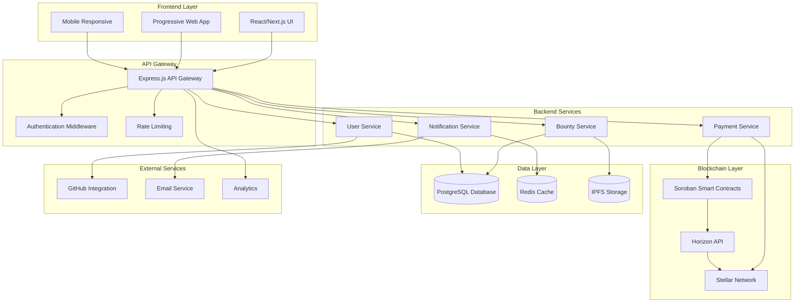
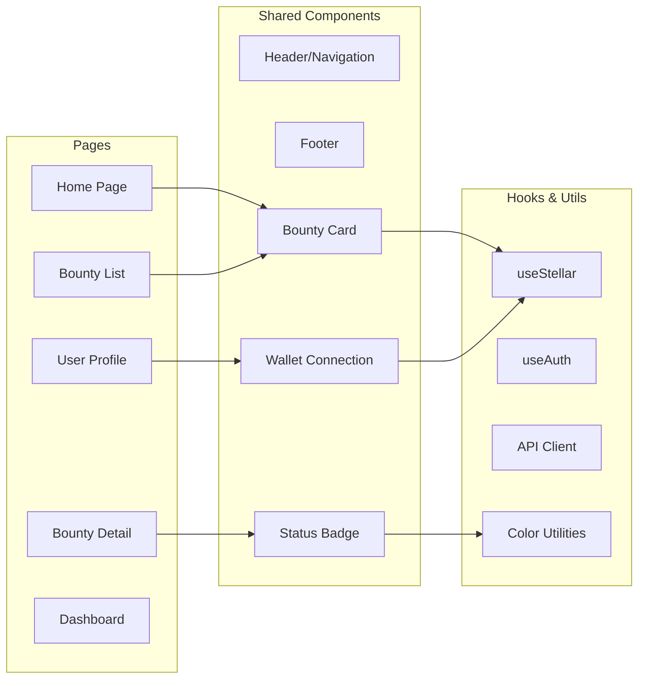
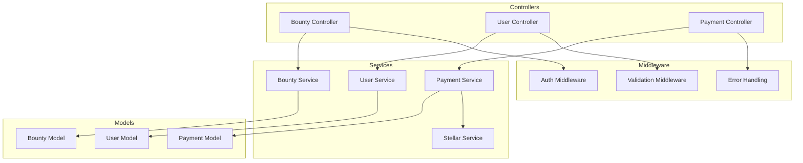
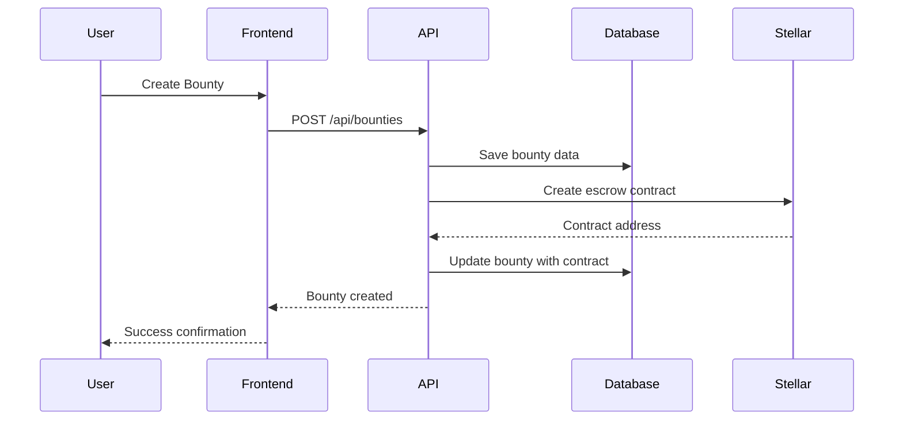
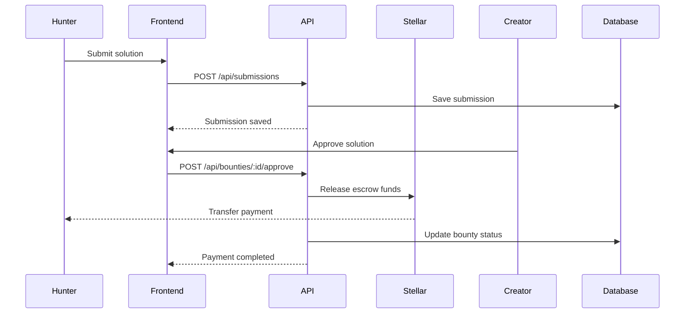
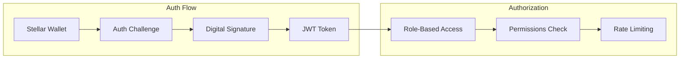
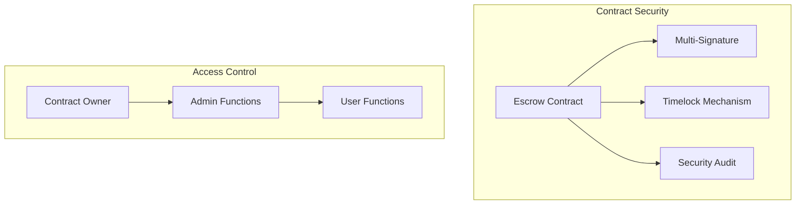
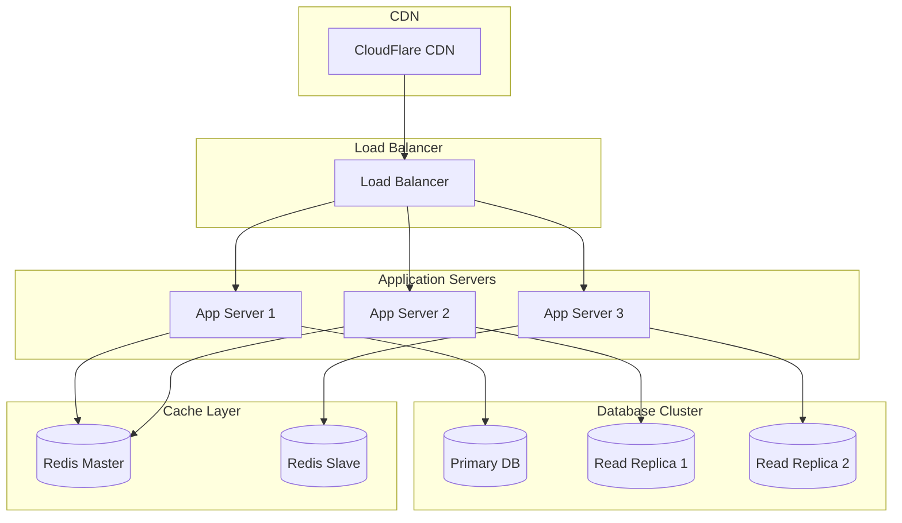
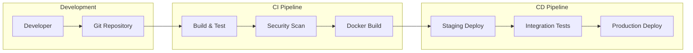

# Stellar Bounty Board Architecture

## System Overview

## Component Architecture

### Frontend Components

### Backend Services Architecture

## Data Flow

### Bounty Creation Flow

### Payment Flow

## Security Architecture

### Authentication & Authorization

### Smart Contract Security

## Deployment Architecture

### Production Environment

### CI/CD Pipeline

## Performance Considerations

### Caching Strategy

- **Redis**: Session data, API responses, user preferences
- **CDN**: Static assets, images, compiled JavaScript
- **Database**: Query result caching, connection pooling
- **Browser**: Service worker caching, localStorage

### Scalability

- **Horizontal scaling**: Multiple application instances
- **Database sharding**: Partition by user ID or bounty category
- **Microservices**: Separate services for different domains
- **Event-driven architecture**: Async processing with message queues

### Monitoring

- **Application metrics**: Response times, error rates, throughput
- **Infrastructure metrics**: CPU, memory, disk usage
- **Business metrics**: Bounty completion rates, user engagement
- **Stellar network metrics**: Transaction success rates, fees